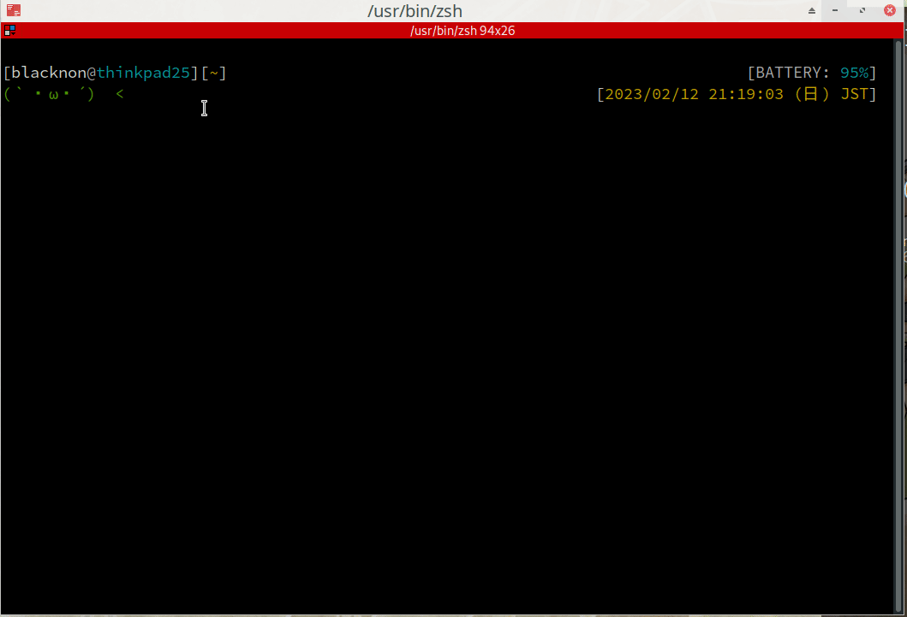

snipt
===

multiple remote platform snippet-code manager command.

<p align="center">

</p>

## Features

- Supported **Github Gist** and **Gitlab Snippets**.
- Can **Get**/**Update**/**Delete** `Remote Snippets`(**Gist**/**Gitlab Snippets**), and **Edit** them directly in your local editor.
- Supports group projects snippet creating at Gitlab Snippets.
- Like [pet](https://github.com/knqyf263/pet), you can choose Remote Snippets with [peco](https://github.com/peco/peco) or [fzf](https://github.com/junegunn/fzf).

## Install

```bash
go get github.com/blacknon/snipt
```

## Configuration

The configuration file is auto-generated in `$XDG_CONFIG_HOME/snipt/config.toml` or `$HOME/.snipt/config.toml` by default.

    [General]
      editor = "vim"                                  # your favorite text editor
      selectcmd = "peco"                              # elector command for edit command (fzf or peco)

    [[Gist]]
      access_token = "ghp_hogehogefugafuga"           # gist access token

    [[Gitlab]]
      url = "https://gitlab.com/api/v4"               # gitlab1 url
      access_token = "glplat-hogehogefugafuga"        # gitlab1 access token

    [[Gitlab]]
      url = "https://hogehoge.gitlab.local/api/v4"    # gitlab2 url
      access_token = "glplat-testtest123123"          # gitlab2 access token


## Usage

    NAME:
       snipt - multiple remote platform snippet manager.

    USAGE:
       snipt [global options] command [command options] [arguments...]

    VERSION:
       0.1.0

    COMMANDS:
       list     list all snippet.
       get      get remote snippet data.
       create   create remote snippet. default by github creates a secret gist, gitlab snippet creates a private snippet.
       update   update remote snippet data.
       edit     edit remote snippet file. use the command specified in `editor` in config.toml for editing.
       delete   delete remote snippet data.
       help, h  Shows a list of commands or help for one command

    GLOBAL OPTIONS:
       --config FILE, -c FILE  load configuration from FILE
       --help, -h              show help
       --version, -v           print the version

### Edit snippet

use `edit` subcommand.

    NAME:
       snipt edit - edit remote snippet file. use the command specified in `editor` in config.toml for editing.

    USAGE:
       snipt edit [command options] [arguments...]

    OPTIONS:
       --visibility github gist, -v github gist  specify visibility according to each github gist/`gitlab snippet`. (default: false)
       --title value, -t value                   specify remote snippet title.
       --secret, -s                              printout (default: false)
       --help, -h                                show help

```bash
snipt edit <options...>
```

### Get snippet list

use `list` subcommand.

    NAME:
       snipt list - list all snippet.

    USAGE:
       snipt list [command options] [arguments...]

    OPTIONS:
       --file, -f    output snippet by file (default: false)
       --secret, -s  printout (default: false)
       --help, -h    show help

```bash
snipt list <options...>
```

### Create snippet

use `create` subcommand.

    NAME:
       snipt create - create remote snippet. default by github creates a secret gist, gitlab snippet creates a private snippet.

    USAGE:
       snipt create [command options] FILE...

    OPTIONS:
       --visibility github gist, -v github gist  specify visibility according to each github gist/`gitlab snippet`. (default: false)
       --title value, -t value                   specify remote snippet title.
       --project_snippet, -p                     output to a list so that it can also support the creation of Gitlab's Project Snippet. (default: false)
       --help, -h                                show help

```bash
snipt create <options...> /path/to/file
```

### Get snippet

use `get` subcommand.

    NAME:
       snipt get - get remote snippet data.

    USAGE:
       snipt get [command options] [arguments...]

    OPTIONS:
       --output PATH, -o PATH  output snippet to PATH
       --file, -f              output snippet by file (default: false)
       --secret, -s            printout (default: false)
       --read, -r              printout to stdout from snippet. (default: false)
       --help, -h              show help

```bash
snipt get <options...>
```

### Update snippet

    NAME:
       snipt update - update remote snippet data.

    USAGE:
       snipt update [command options] [arguments...]

    OPTIONS:
       --file, -f                                output snippet by file (default: false)
       --visibility github gist, -v github gist  specify visibility according to each github gist/`gitlab snippet`. (default: false)
       --title value, -t value                   specify remote snippet title.
       --secret, -s                              printout (default: false)
       --help, -h                                show help

```bash
snipt update <options...> /path/to/file
```

### Delete snippet

    NAME:
       snipt delete - delete remote snippet data.

    USAGE:
       snipt delete [command options] [arguments...]

    OPTIONS:
       --secret, -s  printout (default: false)
       --help, -h    show help

```bash
snipt delete <options...>
```
